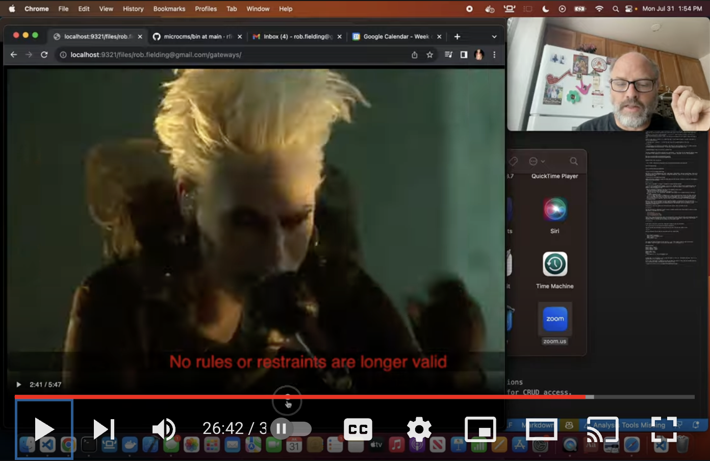
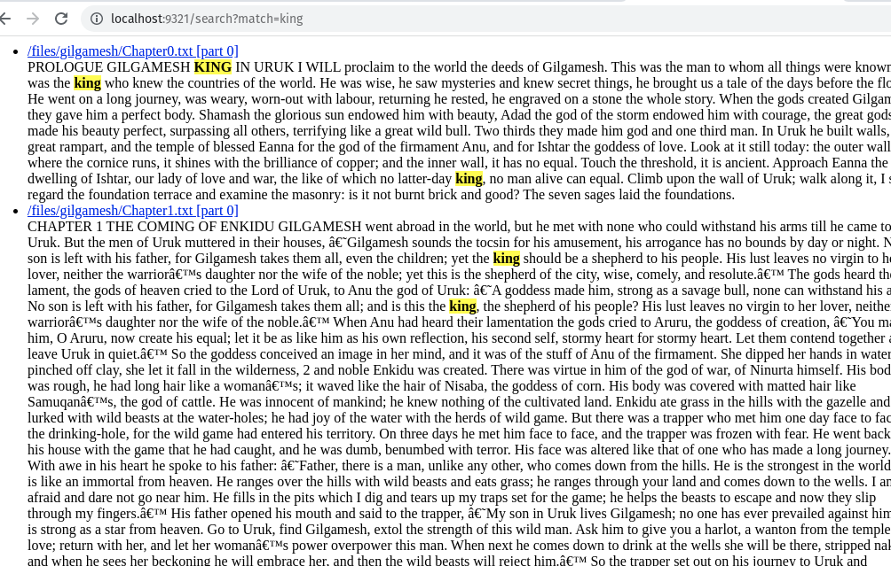
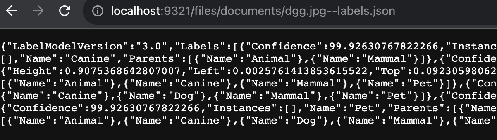
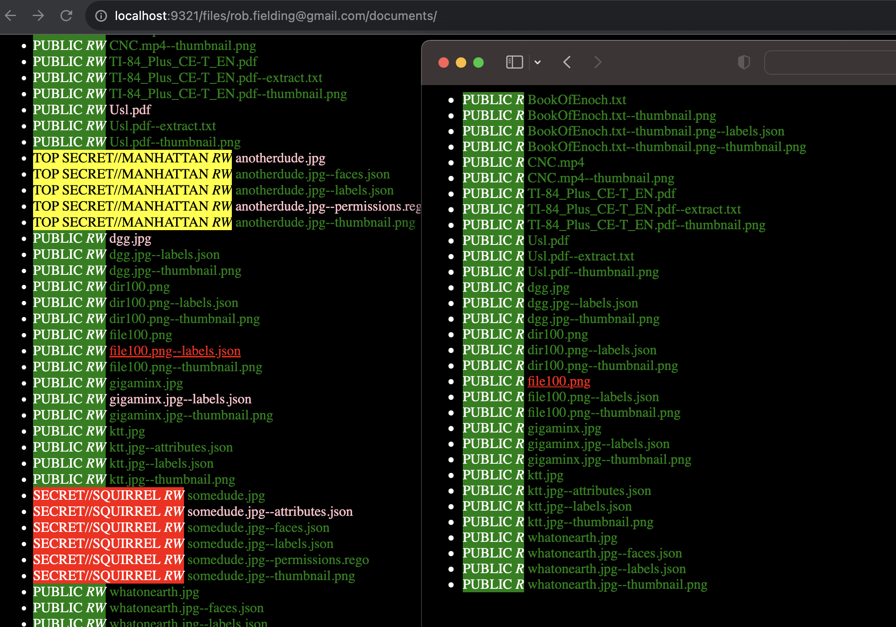
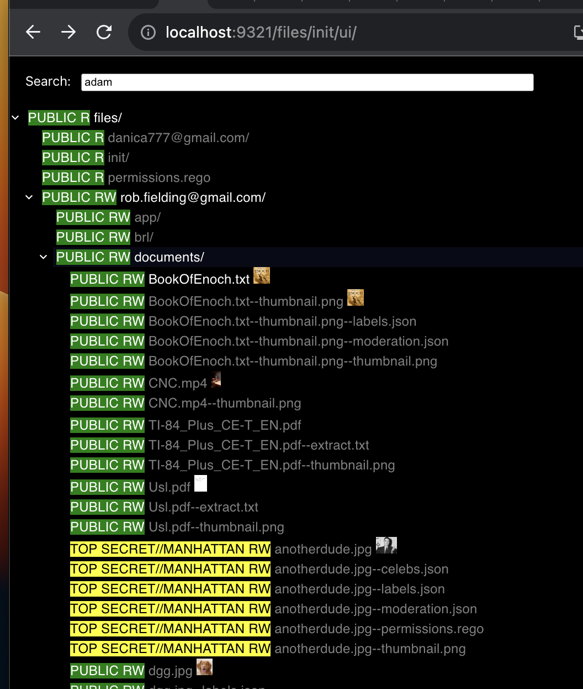
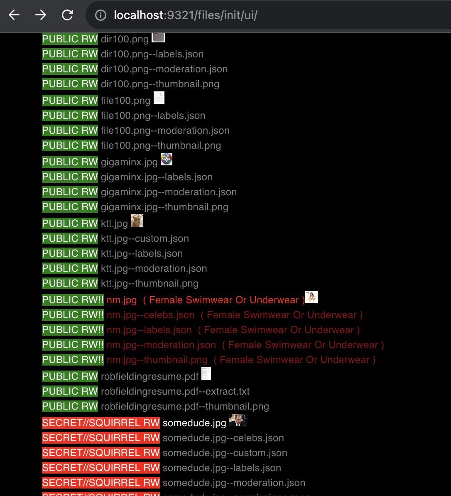

# microcms

A YouTube video to show what this is. It is the backend part of accessibility,
by getting text searching and image labelling done by an AI.

[](https://www.youtube.com/watch?v=yuDblOFiPcQ)

Requirements:

- Docker
- Docker Compose
- curl
- jq
- npx
- npm

This is an experiment in quickly creating a Content Management System (CMS), by which I mean

- upload and download files
- large media files, such as multi-GB mp4s work well and efficiently
- install tarballs of entire static apps (ie: React apps, html pages)
- simple GET/POST to urls to alter content

Note:

- Actual files are just stored on filesystem, while derived items are stored in sqlite3
- all directories are created IMPLICITLY.
- metadata about a directory or file can be uploaded before or after the content
- This allows you to use, or ignore permissions as you see fit
- If you come in authenticated, specific CRUD permissions will be evaluated
- The permission system will allow quite arbitrary rules, as the CRUD permissions
  will be calcualted by code provided by the client; to evaluate a JWT claim for CRUD access.
  (TODO, but I have done this a few times from scratch in a few days) 
- The point of this is to not only allow for anonymous or strongly controlled
  read, but pseudononymous writes as well. ie: GDPR cases, such as directory
  open to adults living in certain countries.
  
Todo:

- reverse proxy endpoints (A few hundred lines of code at most, as I write reverse proxies often)
- the reverse proxy endpoints would allow full apps to work 
- OpenPolicyAgent for security enforcement, I did this in a separate project, and it took a few hours.

It only builds in a Docker container, with go1.20 under Linux amd64 architecture.
I might start splitting things up and moving to ElasticSearch at some point.

```
# runs on http://localhost:9321
./cleanbuild # make the container #ugh! 4 minute build, because of cgo, etc.
```

Launch the contaihner

```
./startup # launch docker compose
```

> note that you have to run `./deployapp` in a different window because of stylesheets and templates that must be uploaded for init.

## API

The API is meant to be as trivial as possible, such that curl examples are more than sufficient.
Currently, there are just GET and POST, where certain prefixes are special.

- POST or GET to `/files/${URL}` means to write the file blob to the given URL.  Not having any kind of oid means that URLs must uniquely identify files (where oids, which I don't want to support) would complicate this.
- a POST to `/files/${URL}` with a parameter `installed=true` means to expect a tarball, and the url is specifying the directory in which it goes.
- GET `/search/${URL}?match=${term}` with a term that you are looking for will render a simple html page of hits.

Install a react app in a tarball, or a simple html app.  Install means to expect a tarball, and unpack it into the named directory.

> in package.json, `homepage="."` so that the react app can be mounted anywhere in the tree.

## Examples

> All directories are created as a side-effect.  But before or after uploading file, it's a TODO to be able to upload metadata such as permissions.  In that case, upload permissions before files.

```
./deployapp # read it to see how it uploads files
```

The API is designed to be easily explored from a web browser.  A few things are not completely obvious though.
If you want a json rendition to a directory listing, or a search, then add `json=true` http parameter:

```
GET http://localhost:9321/files/documents/?json=true                     # show as json
GET http://localhost:9321/files/documents/app/react-test/?listing=true   # list instead of run index.html
GET http://localhost:9321/search?json=true&match=king                    # keyword search
GET http://localhost:9321/me                                             # my attributes
```

Upload a normal file, one by one

```
  curl -X POST --data-binary @resume.pdf http://localhost:9321/files/rob.fielding@gmail.com/docs/resume.pdf
```

Search by keyword king:

```
http://localhost:9321/search?match=dog
```



Note that if you setup AWSRekognition (APIs: label detect, celeb detect), when you upload images, they can be labeled and found in the search; indirectly, through the labelling.  Here is a hit on a dog, for a file with an uninformative name.



Adding reverseproxy endpoints to make full-blown apps work will be easy. Permission system for safe updates a little less so, but not hard.

## How It Works

When a file is uploaded, it triggers a cascade of related simulated uploads.

- if a tar file is uploaded with argument `install=true`, the URL is taken to be an installation path. The tarball is then unpacked, and a simulated upload of all of the files inside of the tarball is done. The upload is recursive because of this.

- When the uploading is happening, then type of file depends on how it goes.
  - Make any directories that don't exist yet.
  - Drop the file on to the filesystem into its place in `./files`
  - If it's a doc that `tika` can extract, then make a text extract file to upload internally. Word docs, pdfs, etc.
    - extract thumbnails on pdf
  - If it's a video, then extract a thumbnail for it. There are no known text extracts for video right now.
  - If it's an image, then submit to a vision API to extract labels on it. Ex: if it's a picture of a dog, then it should show up in a json file later. Extract a thumbnail. This is why imagemagick is included.
  - If it's a text file of some sort, then full-text extract it with microcms. This is the main purpose of including microcms.
  
Because of this recursive breakdown of either unpacking tarballs, or turning files into extracted text, full-text search can now work well. The basic idea is to upload individual files, or tarballs of files. It is known what files will be automatically created (thubnails, text extracts). We can override all of the automatically created files.

Permissions in rego files apply to all the directories inside, unless overrides are done.

## Templates

The html navigation is supported in order to have a reliable interface when things break, or before a proper application is uploaded into the server.

- `init/styles.css`
- `init/rootTemplate.html.templ`
- `init/searchTemplate.html.templ`
- `init/listingTemplate.html.templ`

These files, along with permissions.rego, are initialization config. They are files like everything else. But they are required to navigate with a browser. The idea is that at some point, a React app is the official interface. So all of the html and css is kept out of the server itself.

## Permissions


A user gets a link with a secret link, that sets a cookie to set user attributes.

`GET /registration/?account=5ee5de77d0c566d2b8c170a03894ff2d`

You can see what your attributes are once you have hit this link and your cookie is set:

`GET /me`

And the attributes you get back are associated with your random token.

```
{
  "age":["adult","driving"],
  "email":["rob.fielding@gmail.com"],
  "name":["robf"],
  "role":["admin","user"]
}
```

The reason for these attributes is that that the `*.rego` files ingests claims to make calculations.
For example. Anyone can read it, but you must have email `rob.fielding@gmail.com`

```
package microcms

default Label = "PUBLIC"
default LabelBg = "green"
default LabelFg = "white"

default Read = true
default Write = false
Write {
  input["email"][_] == "rob.fielding@gmail.com"
}
```

So that when `rob.fielding@gmail.com` is used, the label is `PUBLIC RW`. And anyone else sees `PUBLIC R` to indicate that it is a read-only file.

In this case, enforcement is happenint such that one adult user sees all files, and the non-adult does not. Also, not being the owner, the non-adult sees read-only files.



# The React UI

The React UI sitting at `/files/init/ui/` is a basic React UI for the tree.
It implements searching that marks the tree for where content can be found.

Here is a keywoard search that stays around while you are navigating the tree. The word "adam" shows up in the book of Enoch below.



Here is an example of a moderation filter, ie: looking for inappropriate images so that they can be hidden or blurred, or the user being disciplined for posting it. When I search for a "person", a picture identified by AWSRekognition is identified. But notice that an image near by (an infamous Nicki Minaj pick) is labelled as suggestive.




